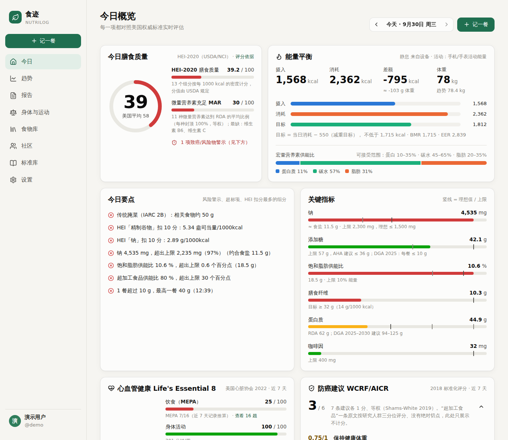
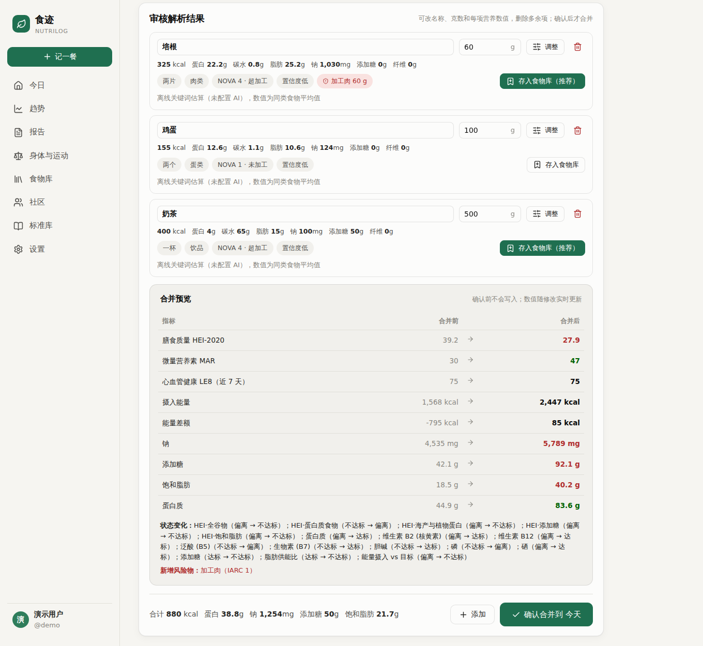
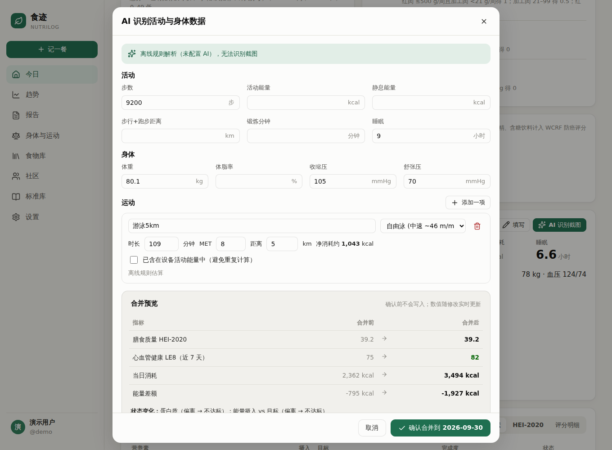
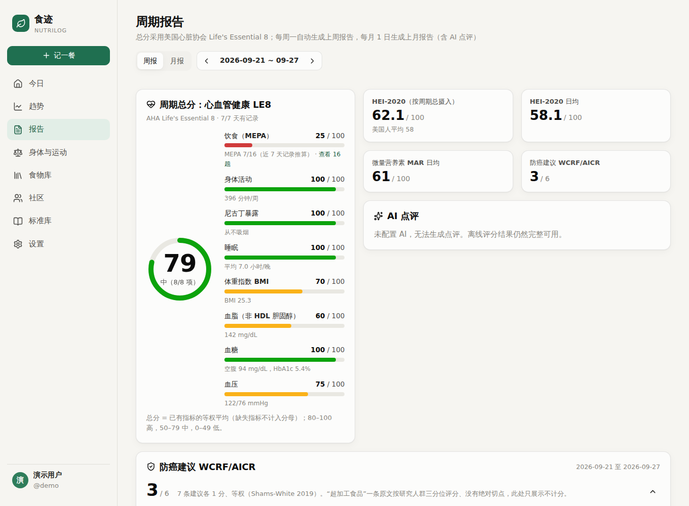
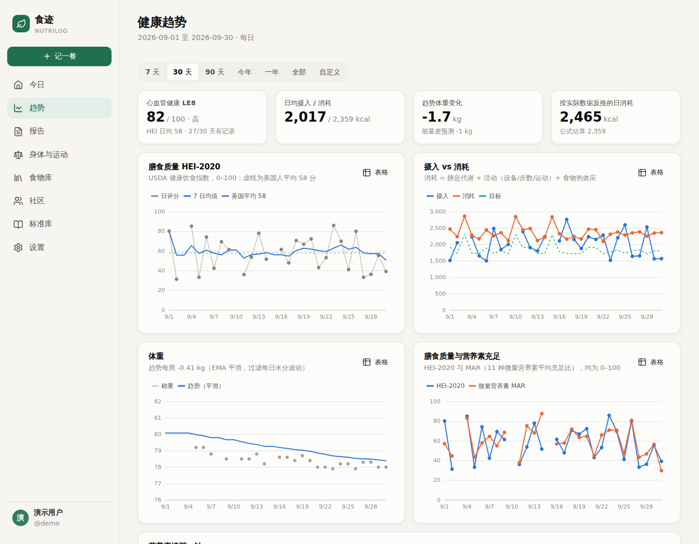
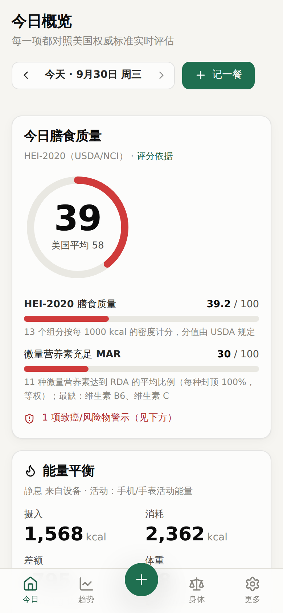
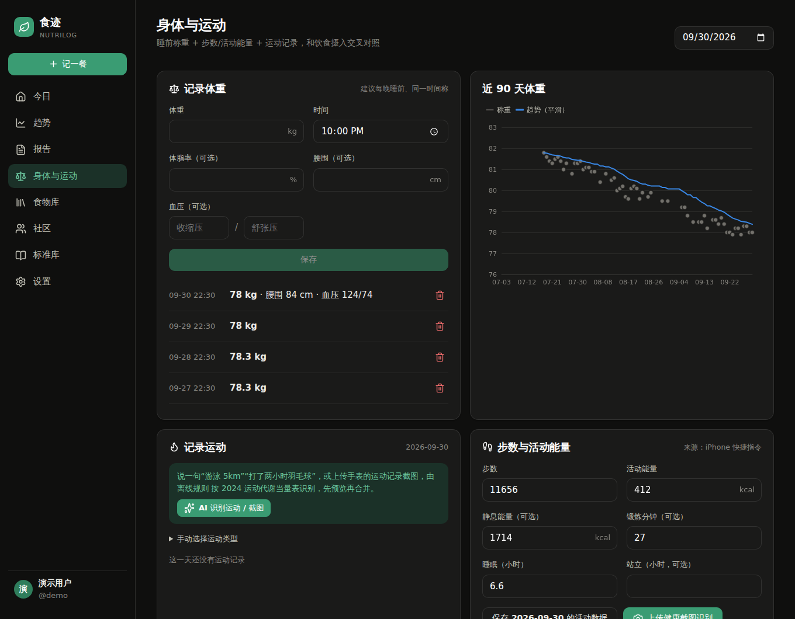

# 食迹 NutriLog

多人使用的每日饮食记录与健康评分网站。用一句话（或一张照片）记录吃了什么，由 Claude 拆解成 40 多种营养素、USDA 食物组和致癌/风险物标记；你审核、修改后再合并，服务器对照**美国已发表的权威评分体系**离线打分，并把摄入、消耗、体重、血压、睡眠放在一起追踪。

**打分一览**（全部采用已发表的评分体系，不自定权重，详见 [docs/scoring.md](docs/scoring.md)）：

| | 总分（0–100） | 同时给出 |
|---|---|---|
| 每天 | **HEI-2020 膳食质量**（USDA/NCI，美国人平均 58） | 微量营养素充足 MAR；近 7 天的 Life's Essential 8 与 WCRF/AICR 防癌评分 |
| 每周 / 每月 | **AHA Life's Essential 8 心血管健康**（饮食、运动、尼古丁、睡眠、BMI、血脂、血糖、血压） | 周期 HEI-2020、HEI 日均、MAR 日均、WCRF/AICR 防癌评分（0–6） |

钠、添加糖、饱和脂肪、各营养素是否达到 RDA、能量平衡、IARC 致癌物等逐项标出“达标 / 不达标”和差多少，但不再另外折算成分数。



## 功能

- **个人档案**：性别、出生日期、身高、体重、活动水平、目标（减重/维持/增重）、孕期/哺乳期、高血压/高胆固醇/糖尿病等状况。所有目标按年龄、性别、体重个性化计算。
- **自然语言记一餐**：“中午一包李子柒螺蛳粉加一个卤蛋，喝了罐可乐”。可以附食物照片、包装、配料表或营养成分表照片。Claude（默认 Opus 5.5）会：
  - 估算每种食物的份量（g），以及 43 种营养素：能量、三大营养素、纤维、总糖/添加糖、饱和/反式/单不饱和/多不饱和脂肪、ω-3/ω-6、胆固醇、11 种矿物质、14 种维生素、胆碱、水分、咖啡因、酒精；
  - 估算 USDA 食物组当量（水果、蔬菜、深绿色蔬菜、豆类、全谷物/精制谷物、奶、蛋白质、海产、植物蛋白、红肉、加工肉、禽肉）和 NOVA 加工程度；
  - 标记致癌物与风险物（IARC 分级），例如烟熏、炭烤、腌菜、咸鱼、丙烯酰胺、阿斯巴甜等；
  - 遇到品牌包装食品时**联网查询官方营养成分表**，并附上来源链接。
- **先预览、再合并**：AI 分析完不会直接入账。结果先以可编辑列表显示，每一项都可以删除、改克数（营养素按比例重算）、改名称 / 类别 / NOVA / 任意营养素和食物组、增删风险标记，也可以手动加一项。下方实时预览“合并后”今天的 HEI、MAR、近 7 天 LE8 与 WCRF、各项状态和新增风险警示的变化，确认无误再点“确认合并”。
- **食物库**：分析结果可一键“存入食物库”（按每 100 g 保存）；也可以输入名称让 AI 联网查询，或拍营养成分表读取标签数值。下次说出名称会自动匹配，或直接搜索并填克数，不需要再调用 AI。可以设为仅自己可见或所有成员可用。
- **离线评分**（详见 [docs/scoring.md](docs/scoring.md)）：见上表。HEI 每个组分写明“扣了几分、为什么”；LE8 缺哪项数据会告诉你怎么补；WCRF 每条建议写明得分规则；MEPA 16 题可以逐题查看。
- **身体与运动**：睡前称重（体重、体脂、腰围）、血压（可标记服药）、体检化验（总胆固醇、HDL、空腹血糖、HbA1c，支持 mmol/L）、步数 / 活动能量 / 睡眠 / 站立、运动记录。
  - **网页直接录入今天的数据**：手动填写，或者用一句话 / **上传健康 App、手表、体脂秤、血压计的截图**，由 AI 识别步数、活动能量、睡眠、体重、血压和每一项运动。识别结果同样先预览、可修改删除，确认后再合并。
  - “游泳 5km”这类描述由 AI 识别：按 2024 运动代谢当量表选择活动类型与 MET，没给时间时按常见速度推算时长（例如中速自由泳约 110 分钟），千卡数由服务器按体重计算。
  - 也支持 **iPhone 快捷指令每天自动同步**，以及导入“健康”App 的 export.zip。
- **能量交叉对照**：摄入 vs 消耗 vs 体重趋势（EMA 平滑），并用你的真实数据反推每日消耗。
- **趋势可视化**：7 天 / 30 天 / 90 天 / 今年 / 一年 / 全部 / 自定义；评分、分项得分、摄入与消耗、体重、任意营养素（带个人目标线）、年度评分日历、各项达标天数、风险物汇总。每张图都可以切换成数据表。
- **周报 / 月报**：总分为 Life's Essential 8。每周一、每月 1 日自动生成，含 AI 点评（Claude 解读离线评分，给出下期 3–5 条行动建议）。
- **App 接口**：同一套后端提供带版本的 REST API（`/api/v1`）、App 登录令牌、CORS 和 OpenAPI 文档，以后开发手机 App 可以直接复用，见下文“App / API”。
- **多人与分享**：所有成员互相看得到用户名；每个人自己决定数据是否共享、共享给所有人还是指定成员、只共享评分还是完整饮食记录。
- **标准库**：网页里可以查看本站用到的全部标准（DRI 总表、限量、HEI-2020、IARC 风险物、运动 MET、评分规则、资料来源）。
- 浅色 / 深色主题，手机与桌面自适应，可添加到手机主屏幕。

| AI 解析后先审核、预览再合并 | AI 识别运动与健康数据 |
|---|---|
|  |  |
| **周报：LE8 总分 + HEI / MAR / WCRF** | **趋势** |
|  |  |

| 手机 | 深色 |
|---|---|
|  |  |

## 快速开始

需要 **Node.js 22.13 或更高版本**（使用 Node 内置的 SQLite，无需安装数据库）。

```bash
npm install
npm run build        # 构建前端
npm start            # http://localhost:8787
```

打开网页注册账号，填写个人档案就可以开始记录。想先看看效果，可以生成演示数据（账号 `demo` / `xiaolin` / `ahao`，密码均为 `demo123`）：

```bash
npm run seed:demo -w server
```

开发模式（前端热更新在 http://localhost:5173，接口代理到 8787）：

```bash
npm run dev
```

运行测试与类型检查：

```bash
npm test
npm run typecheck
```

## 配置 AI

复制 `.env.example` 为 `.env`。有三种模式（`AI_PROVIDER`）：

| 模式 | 说明 |
|---|---|
| `cli` | 调用服务器上的 `claude -p`（Claude Code）。先 `npm install -g @anthropic-ai/claude-code`，用运行网站的同一个系统用户执行一次 `claude` 完成登录。支持联网搜索和读取照片。 |
| `api` | 用 Anthropic SDK 直接调用 Messages API，需要 `ANTHROPIC_API_KEY`。使用结构化输出与 `web_search` 工具，并启用了服务端 `fallbacks: "default"`：模型因安全分类器拒答时自动换推荐的后备模型重试。 |
| `mock` | 不使用 AI，按内置关键词表粗略估算，网站其余功能完全可用。 |

默认 `auto`：有 `ANTHROPIC_API_KEY` 就用 `api`，否则能找到 `claude` 命令就用 `cli`，都没有就用 `mock`。模型默认 `claude-opus-5-5`，可用 `AI_MODEL` 修改；`AI_EFFORT` 控制思考深度。

AI 调用在后台队列里执行，前端轮询进度。一次带联网查询的分析通常需要 30–90 秒。可以用下面的命令在命令行直接测试：

```bash
cd server
npx tsx src/scripts/tryAi.ts "中午吃了一包李子柒螺蛳粉，加了一个卤蛋"
npx tsx src/scripts/tryExercise.ts "游泳5km，晚上快走40分钟"
npx tsx src/scripts/tryActivity.ts "今天走了9200步，游泳5km，睡了7个半小时，体重76.2，血压128/82"
```

## 连接苹果健康

网页无法直接读取 HealthKit，提供三种方式（“身体与运动”页面有详细步骤）：

1. **网页直接录入**：今日页或“身体与运动”页点“填写”手动输入，或点“AI 识别截图”上传“健康”App / 手表的截图（也可以直接说“今天走了 9000 步，睡了 7 个半小时”），识别结果审核后合并。
2. **iPhone 快捷指令**：在设置里生成个人 Token，用“快捷指令 → 自动化”每晚读取步数、活动能量、静息能量、睡眠、体重，`POST` 到 `/api/health/ingest`，请求头 `Authorization: Bearer <Token>`：

   ```json
   {"steps": 8532, "active_kcal": 412, "resting_kcal": 1620, "exercise_min": 35, "sleep_hours": 7.2, "weight_kg": 68.2}
   ```

3. **导出文件**：健康 App → 头像 → 导出所有健康数据，上传 `export.zip` 或 `export.xml`。会导入每日步数、活动/静息能量、距离、锻炼分钟、体重、体脂；iPhone 与 Apple Watch 的重复数据会去重。

手动记录的运动可以标记“已含在设备活动能量中”，避免重复计算。

## App / API

网页用到的所有功能都通过同一套 REST 接口提供，手机 App 可以直接复用：

- 接口地址：`/api/v1/...`（网页用的 `/api/...` 是同一套接口的别名）。
- 接口文档：`/api/docs`（Swagger UI），机器可读的规范在 `/api/openapi.json`（OpenAPI 3.1）。
- 登录：`POST /api/v1/auth/token`，返回 `nla_` 开头的 App 令牌，之后每个请求带 `Authorization: Bearer <token>`。注册时传 `device_name` 也会直接返回令牌。令牌有效期由 `APP_TOKEN_DAYS` 控制（默认 365 天）。
- 设备管理：`GET /api/v1/auth/sessions` 列出已登录的网页和设备，`DELETE /api/v1/auth/sessions/:id` 注销某台设备。
- 跨域：浏览器端 App 需要把来源加入 `CORS_ORIGINS`（逗号分隔，或 `*`）。原生 App 不受影响。

一次完整的“记一餐”流程：

```bash
BASE=http://localhost:8787/api/v1
TOKEN=$(curl -s $BASE/auth/token -H 'Content-Type: application/json' \
  -d '{"username":"demo","password":"demo123","device_name":"iPhone"}' | jq -r .token)
H="Authorization: Bearer $TOKEN"

# 1. AI 分析（异步），返回 job_id；照片先 POST /uploads 拿到 id 再放进 photos
JOB=$(curl -s $BASE/ai/meal -H "$H" -H 'Content-Type: application/json' \
  -d '{"text":"一包李子柒螺蛳粉，一个卤蛋","meal_type":"lunch","time":"12:30"}' | jq -r .job_id)

# 2. 轮询，直到 status 为 done（或 error）
curl -s $BASE/ai/jobs/$JOB -H "$H" | jq '.status, .result.items[].name'

# 3. （可选）预览合并前后的评分变化：POST /preview {date, meal:{meal_type, time, items}}
# 4. 用户审核、修改 items 后保存：POST /meals {date, time, meal_type, description, items}
```

运动与健康数据的对应接口是 `POST /ai/activity`（文字 + 截图识别）→ `POST /preview` → `POST /activity/commit`。今日评分 `GET /day/:date`，趋势 `GET /trends`，周报 `GET /period?start=&end=`。

## 部署建议

- 用 `pm2`、`systemd` 或 Docker 常驻运行 `npm start`；前面放 Nginx/Caddy 提供 HTTPS，并设置 `COOKIE_SECURE=true`。
- 只给家人朋友用时设置 `INVITE_CODE`，或者建好账号后把 `ALLOW_REGISTRATION` 设为 `false`。
- 定期备份 `DATA_DIR`（默认 `data/`，包含 SQLite 数据库和上传的照片）。
- iPhone 快捷指令和手机 App 需要能从外网访问 `/api/...`。

## 项目结构

```
server/                 Node + Express + SQLite（node:sqlite）
  src/standards/        标准数据库：营养素字典、DRI、HEI-2020、IARC 风险物、MET、能量方程、个性化目标、资料来源
  src/scoring/          离线评分引擎：HEI-2020 与 MAR（每日）、Life's Essential 8 与 MEPA、WCRF/AICR、周期、体重趋势
  src/ai/               Claude 调用（claude -p / API / 离线）、提示词、JSON Schema、任务队列
  src/routes/           REST 接口（/api/v1 与 /api）
  src/openapi.ts        OpenAPI 3.1 规范（/api/openapi.json，Swagger UI 在 /api/docs）
  src/services/         数据装载、评分缓存、定时任务
  test/                 评分引擎单元测试
web/                    React + Vite + ECharts 前端
docs/scoring.md         离线评分标准说明
```

## 免责声明

营养数据由 AI 估算，评分依据公开的人群标准，仅用于自我管理参考，不构成医疗建议。孕期、慢性病（尤其肾病、糖尿病）请遵医嘱调整目标。
